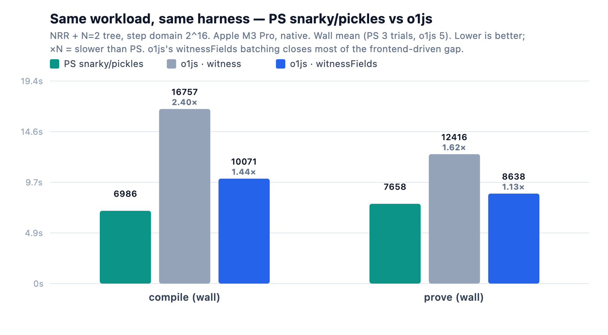
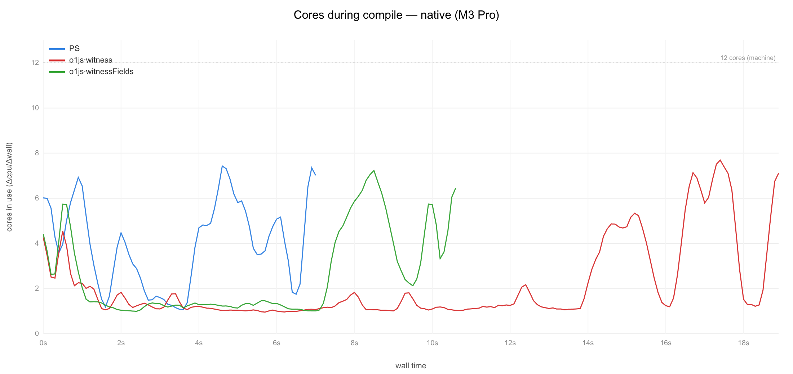
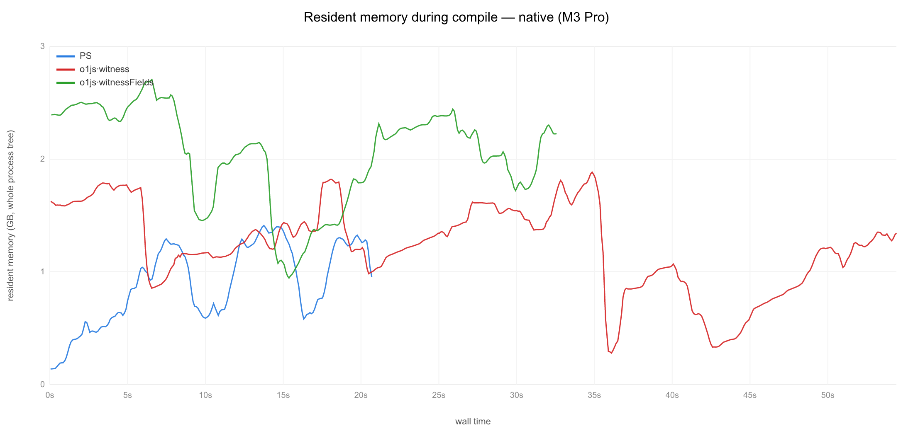
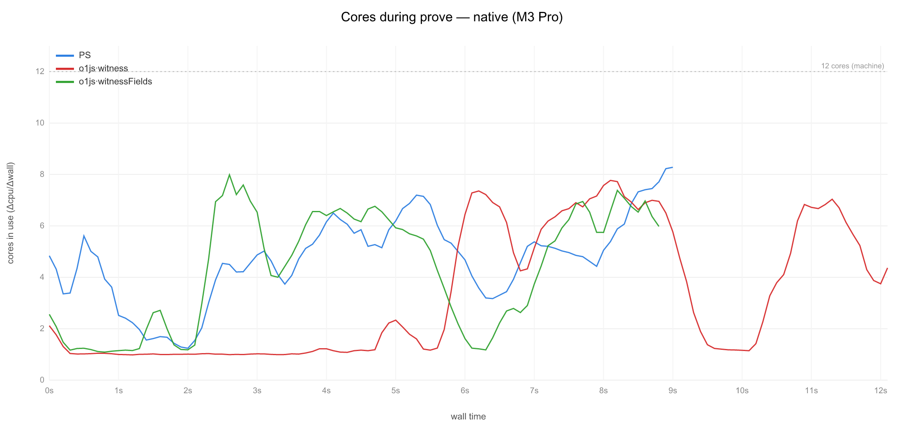
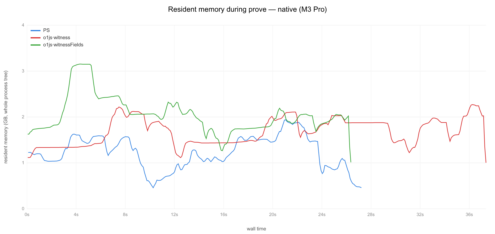
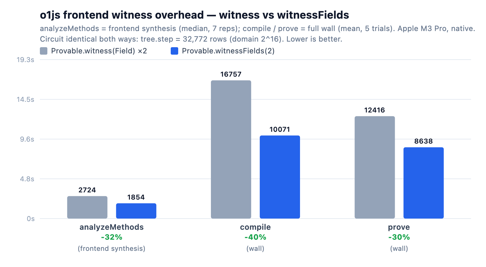

# Benchmark suite — snarky-PS vs o1js (native)

An apples-to-apples benchmark of this repo's PureScript pickles stack against
o1js, on the same recursive proof workload (NRR base + N=2 tree merge, step
domain 2^16) driven through one shared JS bench runner (`bench/harness`). The
programs are defined in `packages/pickles-bench/src/Common.purs` and
`bench/o1js/src/programs.ts`. Both stacks resolve the *same* `runBench`, so the
comparison is the harness, not the circuit-construction API.

It also isolates an actionable o1js result: the step circuit's frontend witness
construction — 131,072 primitive `Provable.witness(Field, …)` calls — is a large
share of o1js's wall time here, and batching it into a single
`Provable.witnessFields(2, …)` (no circuit change, identical constraints) closes
**~68% of the compile gap** and **~79% of the prove gap** to the PS stack.

<p align="center">

</p>

## Quick start

```sh
tools/bench.sh                              # PS native, full suite (compile + prove)
tools/bench_o1js.sh --native               # o1js native, witness filler
BENCH_WITNESS_FIELDS=1 tools/bench_o1js.sh --native   # o1js native, witnessFields filler
tools/bench.sh --only prove                # one group
tools/bench.sh --help                      # full usage
```

## Results

_Apple M3 Pro (12 cores), macOS 26.5.1, node v24.10.0, native backends
(kimchi-napi for PS, `@o1js/native` for o1js), o1js 2.15.0. Wall = mean of the
timed trials (PS 3, o1js 5), run under `caffeinate` on an idle box._

The step circuit is domain 2^16 on both stacks; raw gate counts differ by
accounting (32,772 rows o1js vs ~53,960 PS), so the comparison is per-workload
(one full NRR+tree compile / one b1 recursive prove), not per-row.

### Compile — NRR + tree, step domain 2^16

| config | wall mean (s) | stddev (s) | cpu mean (s) | cores |
|---|---|---|---|---|
| PS native                   | 6.99  | 0.36 | 26.52 | 3.8 |
| o1js native · witness       | 16.76 | 0.81 | 33.73 | 2.0 |
| o1js native · witnessFields | 10.07 | 0.49 | 26.61 | 2.6 |

o1js·witness is 2.40× slower than PS; witnessFields cuts that to 1.44× (closes
68% of the gap). Its compile CPU-time (26.6 s) then matches PS's (26.5 s) almost
exactly — the residual wall gap is parallelism, not work.

<p align="center">
<br/>
<sub>Cores in use during compile (trial-averaged). o1js·witness (red) sits near 1 core for ~14 s of serial JS witness-gen; witnessFields (green) collapses that valley; PS (blue) sustains the highest parallelism and finishes first.</sub>
</p>

<p align="center">
<br/>
<sub>Resident memory during compile (all trials). witnessFields trades some memory — larger batched <code>exists</code> arrays — for the frontend speedup.</sub>
</p>

### Prove — b1 recursive merge

| config | wall mean (s) | stddev (s) | cpu mean (s) | cores |
|---|---|---|---|---|
| PS native                   | 7.66  | 0.28 | 38.02 | 5.0 |
| o1js native · witness       | 12.42 | 0.29 | 40.62 | 3.3 |
| o1js native · witnessFields | 8.64  | 0.45 | 37.18 | 4.3 |

o1js·witness is 1.62× slower than PS; witnessFields cuts that to 1.13× (closes
79% of the gap). Backend proving CPU is essentially flat between the two o1js
paths (40.6 → 37.2 s) — the win is frontend, not the proving math.

<p align="center">
<br/>
<sub>Cores in use during prove (trial-averaged). The serial witness-gen valley (o1js·witness, red) that precedes the parallel FFT/MSM peaks shrinks under witnessFields (green), pulling its curve toward PS (blue).</sub>
</p>

<p align="center">
<br/>
<sub>Resident memory during prove (all trials).</sub>
</p>

## Why witnessFields is a frontend win

`Provable.witness(Field, …)` pays, per call, a `snarkContext` enter/leave, an
`exists(1)` round-trip, `toFields`/`fromFields`, and `Field.check`.
`witnessFields` issues **one** batched `exists(size)` for the whole tuple, skipping
the per-element bookkeeping (and `Field.check`, a no-op for `Field`). Gated behind
`BENCH_WITNESS_FIELDS=1` (default off = historical path); both build the **same**
constraint (two witnessed zeros + one generic-gate multiplication):

```ts
// BENCH_WITNESS_FIELDS=1
const [z1, z2] = Provable.witnessFields(2, () => [0n, 0n]);
z1.mul(z2);
```

`analyzeMethods()` is pure circuit synthesis — no keygen, no proving — so it's the
sharpest measure of frontend cost, and it isolates the change from the backend:

<p align="center">

</p>

| o1js metric | witness | witnessFields | Δ |
|---|---:|---:|:--:|
| analyzeMethods (median, 7 reps) | 2724 ms | 1854 ms | **−32% (1.47×)** |
| compile wall | 16757 ms | 10071 ms | −40% |
| prove wall | 12416 ms | 8638 ms | −30% |
| prove **cpu** | 40620 ms | 37175 ms | **−8%** |

The o1js constraint system is identical either way — `tree.step` = **32,772 rows
(domain 2^16)** with the flag on or off — and proofs still verify (base
`publicOutput = 0`, merge `= 1`, `Tree.verify()` = `true`).

**Caveat on generality:** this circuit is 131k trivial witness ops at a light 2^16
domain, so the JS frontend is an unusually large share of total wall time — which
is *why* the change moves `compile`/`prove` (and the PS gap) so much here. On a
circuit dominated by heavy backend crypto, the same change shrinks `analyzeMethods`
similarly but barely dents `compile`/`prove` wall.

## Setup

```sh
# from repo root — one-time
npm install                                # root deps
npm run build:napi                         # native kimchi-napi (PS backend)
make fetch-srs                             # SRS cache (PS)
make gen-linearization                     # generates Pickles.Linearization.{Pallas,Vesta}
cd bench/o1js && npm install && cd ../..    # o1js deps
```

Each run writes a `bench-results/*.json` artifact (schema shared across stacks via
`bench/harness`) with per-trial wall/cpu samples and row counts — the source for
the tables and bar charts. The cores/RSS timelines come from
[`tools/profile/`](../tools/profile/) (`cpu_timeline.mjs` samples the whole process
tree — `/proc` on Linux, `ps` on macOS — so it sees native Rust/rayon threads;
`timeline_chart.mjs` renders the overlaid curves).

> Reproducibility: results are machine-specific — only compare runs from the same
> box, one bench at a time, on an idle machine. On a laptop, wrap runs in
> `caffeinate` so an idle sleep can't stall a trial (a suspended trial shows up as
> a huge wall with flat CPU).
