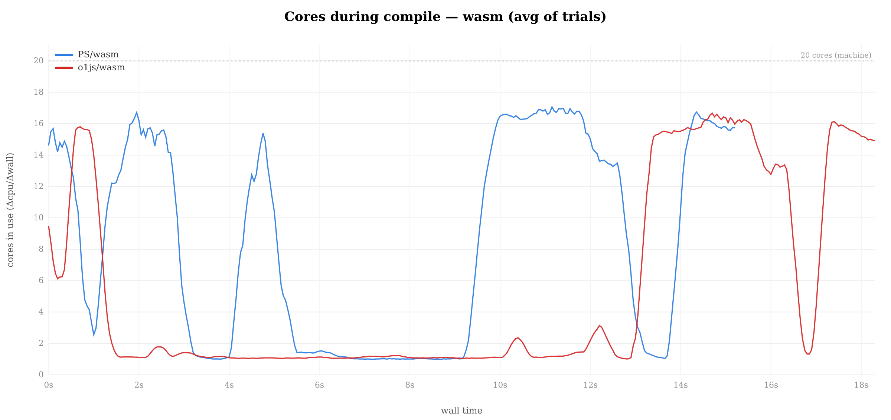
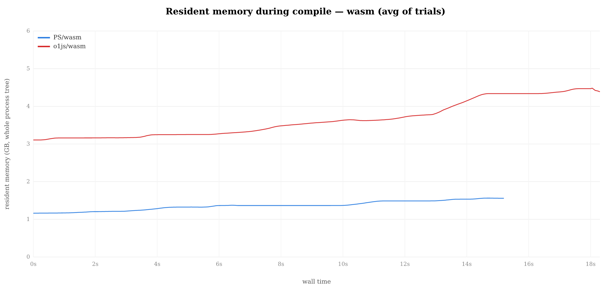
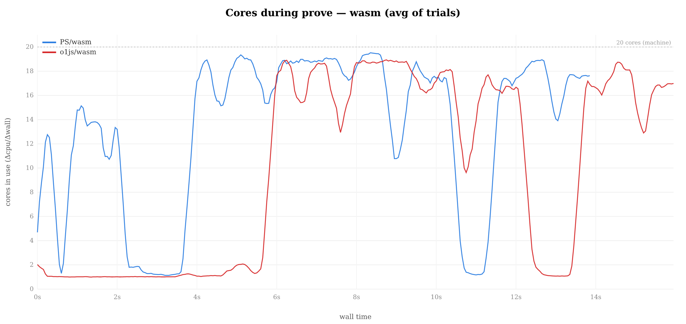
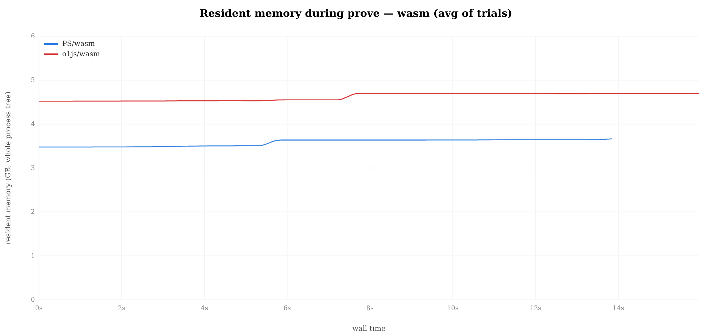

# Benchmark suite — snarky-PS vs o1js (native & wasm)

An apples-to-apples benchmark of this repo's PureScript pickles stack against
o1js, on the same recursive proof workload (NRR base + N=2 tree merge, step
domain 2^16) driven through a shared JS bench runner (`bench/harness`).

## Quick start

```sh
tools/bench_matrix.sh --iters 5        # N iterations × 4 configs
```

To run one config by hand:

```sh
tools/bench.sh --only prove            # PS native, prove only
tools/bench_o1js.sh --native --only prove
tools/bench.sh --help                  # full usage
tools/bench_o1js.sh --help
```

## Results

_Intel Core i5-13500 (20 threads), node v23.11.1, 5 iterations._

### Compile — NRR + tree, step domain 2^16

| config | wall mean (s) | stddev (s) | cpu mean (s) | cores |
|---|---|---|---|---|
| PS native   | 5.96  | 0.13 | 36.74  | 6.2 |
| o1js native | 15.61 | 0.06 | 40.54  | 2.6 |
| PS wasm     | 15.11 | 0.09 | 125.92 | 8.3 |
| o1js wasm   | 18.11 | 0.09 | 98.14  | 5.4 |

- **native:** o1js / PS = `2.62×`
- **wasm:** o1js / PS = `1.20×`

<p align="center">
<br/>
<sub>Cores in use during compile (native). PS (blue) sustains higher parallelism; o1js (red) spends more time single-threaded.</sub>
</p>

<p align="center">
<br/>
<sub>Cores in use during compile (wasm).</sub>
</p>

<p align="center">
<br/>
<sub>Resident memory during compile (native).</sub>
</p>

<p align="center">
<br/>
<sub>Resident memory during compile (wasm).</sub>
</p>

### Prove — b1 recursive merge

| config | wall mean (s) | stddev (s) | cpu mean (s) | cores |
|---|---|---|---|---|
| PS native   | 6.29  | 0.15 | 62.07  | 9.9  |
| o1js native | 10.42 | 0.04 | 57.42  | 5.5  |
| PS wasm     | 13.67 | 0.04 | 187.64 | 13.7 |
| o1js wasm   | 15.92 | 0.03 | 157.65 | 9.9  |

- **native:** o1js / PS = `1.66×`
- **wasm:** o1js / PS = `1.16×`

<p align="center">
<br/>
<sub>Cores in use during prove (native, trial-averaged).</sub>
</p>

<p align="center">
<br/>
<sub>Cores in use during prove (wasm, trial-averaged).</sub>
</p>

<p align="center">
<br/>
<sub>Resident memory during prove (native, trial-averaged).</sub>
</p>

<p align="center">
<br/>
<sub>Resident memory during prove (wasm, trial-averaged).</sub>
</p>

## Circuit parity

Both stacks implement the same recursive program: an NRR (no-recursion-return)
base case + an N=2 tree merge rule. The rule body is identical: conditional
verification of the self-slot, filler multiplications (`mul(witness(0),
witness(0))` × 2^16 iterations), and an output counter. See
`packages/pickles-bench/src/Common.purs` and `bench/o1js/src/programs.ts`.

The row counts differ (PS 53,960 vs o1js 32,772) because the two stacks use
different Kimchi gate decompositions for the same operations — PS's snarky
emits ~0.5 rows per filler multiplication, o1js ~0.18. The recursion verification
overhead is similar (~21K rows both). Both land in **domain 2^16**, which is the
prover's actual workload size (FFT, polynomial commitments, and IPA are all
domain-bound, not row-bound).

## Setup

From the repo root:

```sh
npm install                              # root deps + native kimchi-napi
npm run build:wasm -w kimchi-napi        # wasm binding (for --wasm)
make fetch-srs && make gen-linearization # SRS + pickles codegen
cd bench/o1js && npm install && cd ../.. # o1js deps
```

Profiling tooling: [`tools/profile/`](../tools/profile/README.md).
